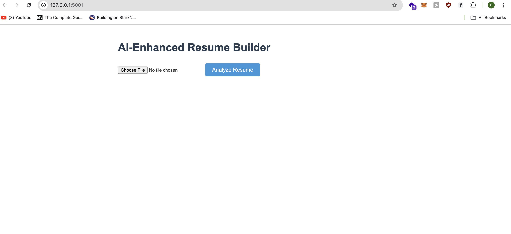
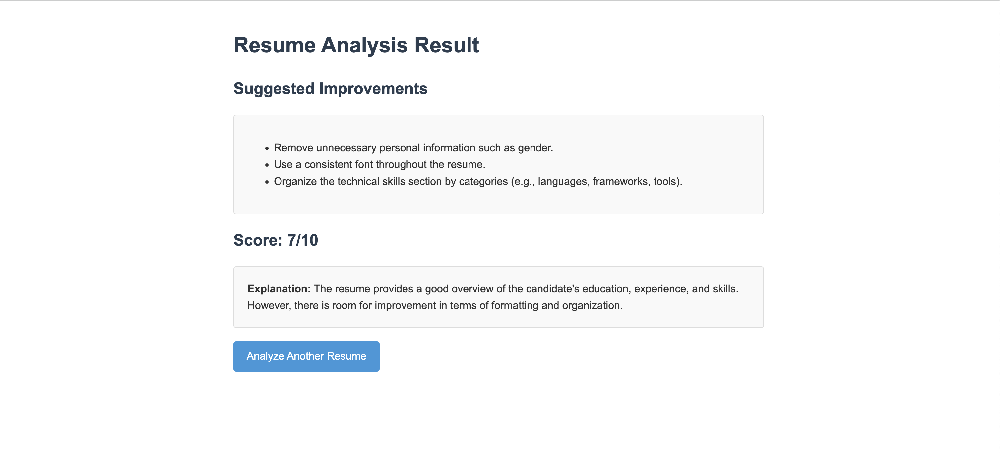

# AI-Enhanced Resume Builder 📄✨

Web app that which accepts resume and provides suggestions for improvement.

Detailed comparison about the differences between parameters when this app is hosted in Docker vs Virtual Machine (VMWare Fusion) [https://docs.google.com/document/d/10S9jmPK16Pbau2It-Z-6X36o4WL_pL-QwXXx29pnH14/edit#heading=h.e9q77z7jpgmf](https://docs.google.com/document/d/10S9jmPK16Pbau2It-Z-6X36o4WL_pL-QwXXx29pnH14/edit#heading=h.e9q77z7jpgmf)

Serverless options comparison document - [https://docs.google.com/document/d/1cRCIpmR47sr1lAr8qa-4ZMvuxk4frwnvmQWaJuWXj8M/edit#heading=h.y2dxy1pxu1me](https://docs.google.com/document/d/1cRCIpmR47sr1lAr8qa-4ZMvuxk4frwnvmQWaJuWXj8M/edit#heading=h.y2dxy1pxu1me)

Deep dived into AWS Lambda architecture

### Home Page


### Results Page


## What it does

This app takes your resume, reads it with AI magic, and then:
1. Suggests ways to make it better 💡
2. Gives your resume a score out of 10 🏆
3. Explains why it gave that score 🤔

## Tech Stack

1. Flask
2. Google Gemini
3. HTML/CSS


## How to use it

1. Clone this repo
2. Install the stuff you need:

```pip install -r requirements.txt```

3. Run the app:

```python app.py```

4. Open your browser and go to `http://localhost:5001`
5. Upload your resume and see the magic happen!

## What you need

- Python 3.7 or newer
- Flask
- google-generativeai
- Some other stuff (check `requirements.txt`)

## Docker commands execution

### Docker build

Command used - `docker build -t resume-builder .`


### Docker run

Command use - `docker run -p 5001:5001 resume-builder`


### Docker push (Push image to docker hub)

Command used - `docker push <_username>/<_imagename>`


### Unit tests using pytest (Non container)

Unit tests execution using pytest (Outside container)


### Docker compose build

Created a docker compose file to collectively build the app source code and run the unit tests parallely in separate containers.


### Docker compose up (Runs test in container)

This command starts the container for both the images, thus runs the unit tests and starts the web app.


Made with 💖 by Puneet Bajaj
